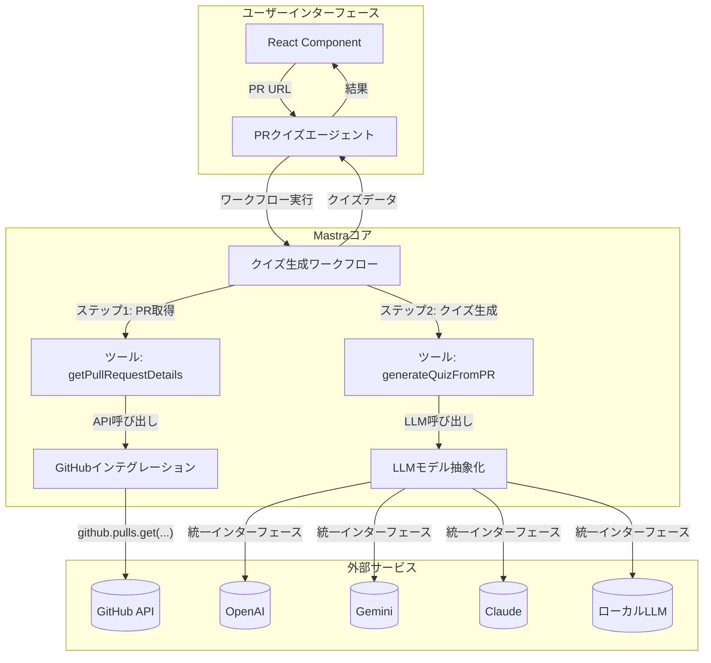

# PR-Quiz-GeneratorのリバースエンジニアリングとMastraへのマッピング

## 1. 現状のアーキテクチャ分析

`pr-quiz-generator`リポジトリは、よく構造化されたアーキテクチャを持っています。

*   **UI層 (`src/App.tsx`)**: Reactで構築されており、状態管理とビジネスロジックのトリガーには`zustand` (`src/store/useQuizStore.ts`) を使用しています。ユーザーがPRのURLを入力すると、`generateQuiz`アクションが呼び出されます。
*   **サービス層 (`src/services/`)**:
    *   `github.ts`: `axios`を使用して直接GitHub APIと通信し、PR情報の取得と解析を担当します。
    *   `ai.ts`: クイズ生成のコアロジックを含みます。抽象クラス`AIService`を定義し、それを`OpenAIService`、`GoogleAIService`、`LocalLLMService`が実装することで、複数のAIプロバイダーをサポートしています。`AIServiceFactory`が設定に応じて適切なプロバイダーを選択します。
*   **データフロー**:
    1.  UIでPRのURLが入力される。
    2.  `useQuizStore`の`generateQuiz`アクションが呼び出される。
    3.  `githubService`がGitHubからPRデータを取得する。
    4.  `QuizGenerator`がPRデータを基にAIへの入力（コンテキスト）を構築する。
    5.  選択されたAIサービス（例: `OpenAI`）が`AIServiceFactory`経由で呼び出され、クイズが生成される。
    6.  生成されたクイズが`useQuizStore`に設定され、UIに表示される。

このアーキテクチャは機能的ですが、ビジネスロジック（特に`generateQuiz`内の処理フロー）が状態管理ストアと密結合しており、外部サービスとの連携コード（`axios`呼び出し）が手動で実装されています。

## 2. Mastraへのマッピング提案

現在のアーキテクチャを、Mastraの強力なプリミティブ（Agent, Workflow, Tool, Integration）にマッピングし、より堅牢で宣言的な構造にリファクタリングする方法を以下に示します。

### Mastraアーキテクチャの概要図

### a. GitHub連携 → `Integration`

現在の`src/services/github.ts`は、Mastraの **Integration** パターンに置き換えるのが理想的です。

*   **現状**: `axios`を使って手動でAPIリクエストを作成し、レスポンスをパースしています。
*   **Mastra化**: Mastraでは、サードパーティサービスとの連携を`Integration`としてカプセル化します。GitHubのような主要なサービスには、多くの場合、組み込みのインテグレーションが用意されています。これにより、以下のようなメリットが生まれます。
    *   **宣言的なコード**: `const pr = await github.pulls.get({ owner, repo, pull_number });` のように、より宣言的で直感的なコードになります。
    *   **型安全性**: Integrationは型安全なクライアントを自動生成するため、APIのレスポンスやリクエストの型を気にする必要が減ります。
    *   **認証管理の簡素化**: APIキーなどの認証情報はMastra側で安全に管理され、コードから分離されます。

### b. 複数AIプロバイダー対応 → `LLM Models`

`src/services/ai.ts`の複数プロバイダー対応ロジックは、Mastraの **LLM Models** 機能に直接マッピングできます。

*   **現状**: `AIService`抽象クラスと具象クラス（`OpenAIService`など）、そして`AIServiceFactory`という自前の仕組みでプロバイダーを切り替えています。
*   **Mastra化**: Mastraは[Vercel AI SDK](https://sdk.vercel.ai/docs/introduction)を基盤としており、異なるLLMプロバイダーを統一されたインターフェースで扱えます。
    *   **設定ベースの切り替え**: `AIServiceFactory`のようなコードは不要になり、設定ファイルで`provider: 'openai'`や`provider: 'google'`と指定するだけで、Mastraが自動的に適切なクライアントを選択します。
    *   **ストリーミング対応**: レスポンスのストリーミングも標準でサポートされており、ユーザー体験の向上に繋がります。
    *   **プロンプト管理**: Mastraにはプロンプトテンプレートの管理機能も含まれており、`getSystemPrompt`や`buildPrompt`のようなメソッドをより体系的に管理できます。

### c. 個別の処理 → `Tool`

`github.ts`や`ai.ts`に含まれる個別の関数やメソッドは、Mastraの **Tool** として切り出すことができます。ToolはAgentやWorkflowから呼び出される再利用可能な関数です。

*   `githubService.parsePullRequest`: PRのURLを受け取り、`GitHub Integration`を使ってPRの全情報を取得・整形して返す`getPullRequestDetails`というToolになります。
*   `QuizGenerator.generateQuestions`: PRデータを受け取り、`LLM Models`を使ってクイズを生成し、JSONとして返す`generateQuizFromPR`というToolになります。
*   `sanitizePatch`: パッチテキストの機密情報をサニタイズする`sanitizePatchText`のような独立したUtility Toolとして定義できます。

### d. クイズ生成フロー → `Workflow`

`useQuizStore.ts`の`generateQuiz`アクションで実装されている一連の処理フローは、Mastraの **Workflow** で再定義するのに最適です。

*   **現状**: Zustandのアクション内に、PR取得→コンテキスト構築→AI呼び出し→状態更新という一連のステップが手続き的に書かれています。
*   **Mastra化**: Workflowは、これらのステップをグラフベースの耐久性のあるステートマシンとして定義します。
    1.  **開始 (入力: prUrl)**
    2.  **ステップ1**: `getPullRequestDetails`ツールを呼び出す。
    3.  **ステップ2**: `generateQuizFromPR`ツールを呼び出す (ステップ1の結果を入力として)。
    4.  **終了 (出力: quizJson)**
    *   **堅牢性**: 各ステップにはエラーハンドリングやリトライロジックを組み込むことができ、Zustandで手動で行っている`isLoading`, `error`の状態管理よりも堅牢になります。
    *   **可観測性**: 各ステップの実行状況は自動的にトレースされ、デバッグや監視が容易になります。

### e. 全体の統括 → `Agent`

最後に、これら全てをまとめるのが **Agent** です。今回のケースでは、ユーザーからのリクエストを受け取り、定義されたWorkflowを実行するシンプルなAgentを構築します。

*   **役割**: UIとWorkflowの間の調整役です。ユーザーからの「このPRでクイズを作って」という指示（`prUrl`）を受け取り、`Quiz Generation Workflow`を実行し、結果をUIに返します。
*   **将来性**: 今は単純なWorkflowを呼び出すだけですが、将来的には「PRの変更内容の複雑さに応じて、`generateSimpleQuiz`と`generateAdvancedQuiz`のToolを使い分ける」といった自律的な判断をAgentに任せることも可能になります。

## まとめと次のステップ

`pr-quiz-generator`のアーキテクチャは、Mastraのパラダイムに非常にうまくマッピングできます。リファクタリングすることで、コードはより宣言的で、堅牢かつ再利用しやすくなります。

**リファクタリング計画案:**

1.  **Mastraプロジェクトのセットアップ**: `create-mastra`を使って新しいプロジェクトを作成します。
2.  **GitHub Integrationの作成**: `github.ts`の機能をMastraのIntegrationとして再実装します。
3.  **Toolの定義**: `parsePullRequest`や`generateQuestions`などのコアロジックをMastraのToolとして切り出します。
4.  **Workflowの構築**: `generateQuiz`の処理フローをMastraのWorkflowとして定義します。
5.  **Agentの作成**: Workflowを呼び出すためのシンプルなAgentを定義します。
6.  **UIの接続**: Reactコンポーネントから、Mastra Agentを呼び出すように修正します。状態管理は、Mastraが提供するフック（存在する場合）や、よりシンプルなUI状態管理に置き換わります。

このリバースエンジニアリングと再実装のプロセスを開始する準備ができましたら、お声がけください。具体的なコードの作成に進みます。
